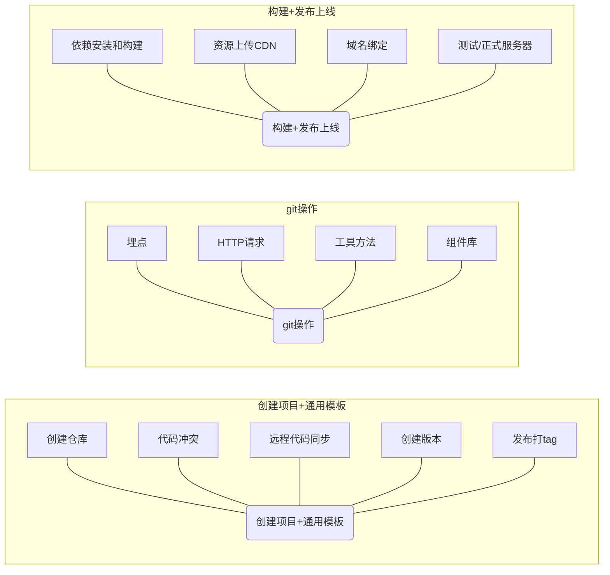

```mermaid
graph LR
subgraph 创建项目+通用模板
	A(创建项目+通用模板)
	创建仓库 --- A
    代码冲突 --- A
    远程代码同步 --- A
    创建版本 --- A
    发布打tag --- A
end
subgraph git操作
	B(git操作)
	埋点 --- B
    HTTP请求 --- B
    工具方法 --- B
    组件库 --- B
end
subgraph 构建+发布上线
	C(构建+发布上线)
	依赖安装和构建 --- C
    资源上传CDN --- C
    域名绑定 --- C
    测试/正式服务器 --- C
end
```

